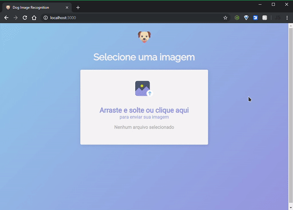

# Dog AI

[](https://app.netlify.com/sites/dogai/deploys)



## 💡 Project

Recognize over 100 dog breeds by drag and drop an image using Tensorflow.js and Teachable Machine.

### Training Process

1. Gather a dataset with a bunch of images
2. Resize and minify all the images
3. Separate dogs image by breed and rename all the files
4. Upload to Teachable Machine
5. Train your model
6. Export your trained model

## 🛠 Tools

- [React](https://reactjs.org/)
- [React Dropzone](https://github.com/react-dropzone/react-dropzone)
- [Tensorflow.js](https://github.com/tensorflow/tfjs)
- [Teachable Machine](https://teachablemachine.withgoogle.com/)

## 💻Demo

[https://dogai.netlify.com](https://dogai.netlify.com)

## 🚀Quick start

### Installation

Clone the repository and run

```bash
$ cd dogAI && yarn
```

### Usage

```bash
$ yarn start
```

## Dataset Reference

Primary:
Aditya Khosla, Nityananda Jayadevaprakash, Bangpeng Yao and Li Fei-Fei. Novel dataset for Fine-Grained Image Categorization. First Workshop on Fine-Grained Visual Categorization (FGVC), IEEE Conference on Computer Vision and Pattern Recognition (CVPR), 2011.

Secondary:
J. Deng, W. Dong, R. Socher, L.-J. Li, K. Li and L. Fei-Fei, ImageNet: A Large-Scale Hierarchical Image Database. IEEE Computer Vision and Pattern Recognition (CVPR), 2009.

## 📝License

This project is licensed under the [MIT License](https://github.com/jeferson-sb/dogAI/blob/master/LICENSE)
